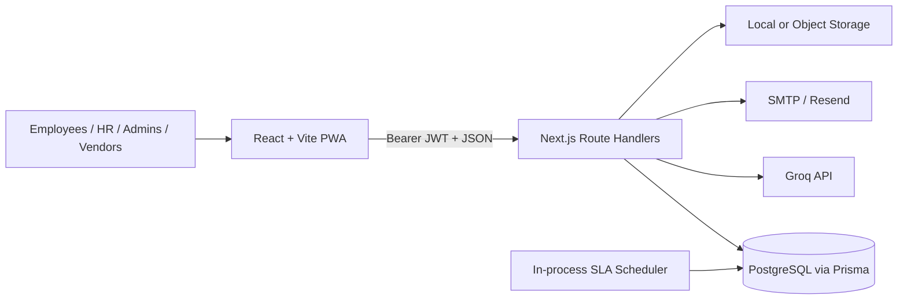

<div align="center">

<h1>HR_APP</h1>
<h3>Enterprise HR Digitalization Platform</h3>
<p>Employee feedback, internal communication, and workforce operations in one role-aware system.</p>
<p>
  
  
  
  
  
</p>
<p>
  <a href="#overview">Overview</a> ·
  <a href="#system-architecture">Architecture</a> ·
  <a href="#core-workflow">Workflow</a> ·
  <a href="#security--reliability">Security</a> ·
  <a href="#local-development">Development</a>
</p>

</div>

## Overview

HR_APP consolidates employee feedback, announcements, team communication, birthday events, notifications, and administrative oversight into one role-aware system for employees, HR teams, administrators, and external vendors.

My engineering scope spans a React/Vite client, Next.js APIs, PostgreSQL/Prisma, storage and email adapters, optional Groq processing, auditable workflows, and reproducible multi-container deployment.

## At a Glance

| Area | Implementation |
| --- | --- |
| Primary users | Employees, HR teams, administrators, and vendors |
| Core workflow | Feedback intake → triage → assignment → resolution → audit |
| Application | React/Vite PWA with Next.js route handlers |
| Data | PostgreSQL with a 15-table Prisma domain model |
| Automation | Optional Groq assistance with deterministic fallbacks |
| Operations | Docker Compose, Nginx, health checks, and persistent volumes |

## Engineering Highlights

- **Five-role authorization model** — shared API guards cover Employee, HR, Admin, Super Admin, and Vendor workflows, with additional resource ownership and membership checks.
- **Structured feedback lifecycle** — feedback moves through submitted, review, progress, resolution, and closure states with assignments, comments, internal notes, timelines, SLA metadata, and vendor approval paths.
- **AI-assisted triage** — Groq can classify category, priority, and vendor relevance, generate reply suggestions, and summarize operational metrics; deterministic application logic remains responsible for access control and workflow transitions.
- **Relational domain model** — Prisma maps 15 PostgreSQL tables covering users, conversations, channels, feedback, attachments, notifications, audit logs, announcements, and birthday registrations.
- **Traceable operations** — feedback actions create audit records and targeted notifications; announcements and birthday invitations fan out updates to affected users.
- **Communication workflows** — public/private channels, direct conversations, pinned messages, announcements, and read receipts share the same authenticated API boundary.
- **Reproducible deployment** — Docker Compose coordinates PostgreSQL, migration/seed jobs, the Next.js API, and an Nginx-served frontend with health checks and persistent volumes.

## System Architecture



## Core Workflow

```text
Employee Feedback
→ Zod / attachment validation
→ AI category, priority, and vendor analysis
→ Deterministic HR/Admin assignment
→ Review, comments, and status transitions
→ Optional vendor hand-off and approval
→ Notifications, audit trail, and analytics
```

> [!NOTE]
> AI output enriches triage data but does not grant permissions or execute privileged workflow actions. If the provider is unavailable, submission still succeeds with safe defaults and manual review remains available.

## Key Features

### Feedback & Case Management

- Anonymous or attributed submissions, attachments, assignments, internal comments, timelines, SLA checks, and vendor approval workflows.

### Communication & Events

- Membership-controlled channels, direct conversations, read receipts, and announcements.
- Transactional birthday-event registration, RSVPs, and persisted notification management.

### Administration & Analytics

- Role/status administration, scoped queues, system metrics, audit-log access, trend summaries, and optional AI reports/reply drafts.

## Security & Reliability

- JWT access and refresh tokens are signed with an algorithm allowlist; each protected request reloads the user and rejects inactive accounts.
- Passwords are hashed with bcrypt, while Zod validates request payloads at API boundaries.
- Authorization is enforced server-side through shared role helpers plus ownership, membership, and participant checks.
- CORS uses an explicit origin allowlist. Secrets and provider credentials are supplied through ignored environment files.
- Uploads enforce size and extension allowlists, server-generated stored names, ownership checks, and attachment downloads. The current malware scanner is a stub and must be replaced before production use.
- PostgreSQL constraints protect key relationships; health checks cover each container.
- Current limitation: browser tokens are stored in `localStorage`. A higher-assurance deployment should move session material to secure `HttpOnly` cookies and add the corresponding CSRF controls.

## Testing & Validation

Two Vitest files exercise password hashing, token creation/verification, query parsing, date formatting, and pagination limits. They are not a passing gate yet because the runner does not resolve the project's `@` path alias. No API integration or end-to-end suite is committed.

```bash
# Current passing production checks
cd nextjs-backend
npm run build

cd ../frontend
npm run build
```

`npm run lint` currently reports three conditional React Hook errors plus warnings and should be fixed before CI enforcement.

## Technology Stack

| Responsibility | Technologies |
| --- | --- |
| Frontend | React 18, TypeScript, Vite, Tailwind CSS, TanStack Query, React Hook Form, Recharts |
| Backend API | Next.js 14 route handlers, TypeScript, Zod |
| Data | PostgreSQL 16, Prisma ORM |
| Authentication | JSON Web Tokens, bcryptjs |
| AI | Groq SDK with deterministic fallbacks |
| Messaging & files | Nodemailer / Resend, local storage, S3, Vercel Blob, or Supabase Storage |
| Infrastructure | Docker, Docker Compose, Nginx |
| Testing | Vitest test files (runner alias configuration pending); Playwright installed without committed tests |

## Deployment

The supported deployment path is Docker Compose:

1. PostgreSQL starts and passes `pg_isready`.
2. A one-shot Prisma job applies the schema and a separate job seeds demonstration data.
3. The Next.js API starts in production mode and exposes `/api/health`.
4. Nginx serves the built React application and applies basic response headers.

Database and upload data use named volumes. TLS, rate limiting, backups, and secret injection belong at the hosting or reverse-proxy layer.

## Demo

> [!IMPORTANT]
> Seeded demonstration accounts are available through the login page; raw credentials are not duplicated here. Replace elevated demo roles before an internet-facing deployment. The previous public URL is omitted because it could not be verified.

## Local Development

### Docker

```bash
git clone https://github.com/Liwei1020T/HR_APP.git
cd HR_APP
cp .env.docker.example .env
# Set a strong JWT_SECRET and review all production values.
./deploy.sh
```

| Service | Local URL |
| --- | --- |
| Frontend | `http://localhost:5173` |
| API | `http://localhost:8000/api/v1` |
| Health check | `http://localhost:8000/api/health` |

<details>
<summary><strong>Manual setup</strong></summary>

<br>

```bash
cd nextjs-backend
npm ci
npx prisma db push
npm run dev

# In another terminal
cd frontend
npm ci
npm run dev
```

</details>

## Project Structure

```text
HR_APP/
├── frontend/src/                 # React pages, components, auth, and API client
├── nextjs-backend/app/api/       # Route handlers grouped by business capability
├── nextjs-backend/lib/           # Auth, AI, storage, email, validation, and services
├── nextjs-backend/prisma/        # PostgreSQL schema, migrations, and seed data
├── nextjs-backend/tests/unit/    # Focused Vitest coverage
├── docker-compose.yml            # Local/hosted service topology
└── deploy.sh                     # Build, initialize, seed, and operate the stack
```

## Engineering Decisions

- **PostgreSQL + Prisma** keep workflow domains relational and enforce important uniqueness constraints.
- **AI remains advisory** so an unavailable or malformed model response cannot bypass authorization or prevent feedback submission.
- **Authorization lives in API handlers**, not only in React route guards, because the client is not a security boundary.
- **Notifications and audit records are persisted** alongside domain actions.
- **Docker separates stateful and stateless concerns** while keeping local evaluation reproducible.
